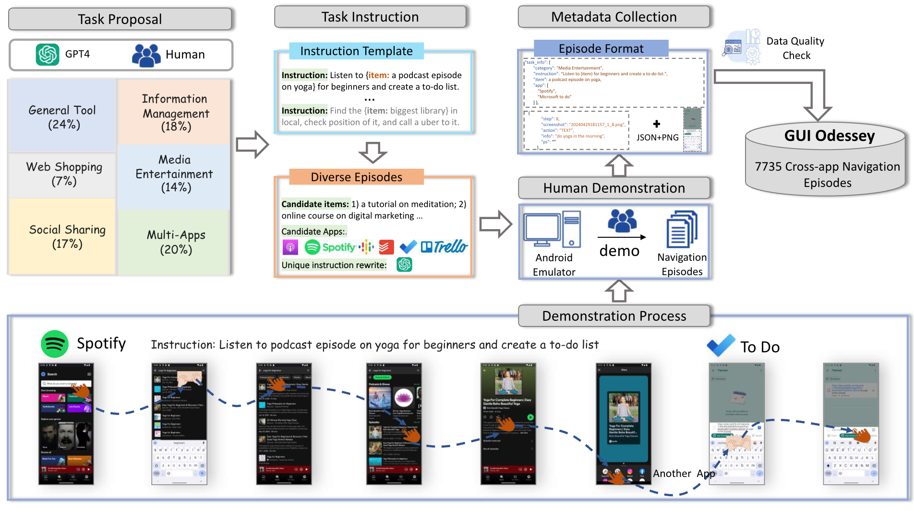

# GUI Odyssey

**This repository is the official implementation of GUI Odyssey.**

> [GUI Odyssey: A Comprehensive Dataset for Cross-App GUI Navigation on Mobile Devices](ARXIV_LINK)  
> Quanfeng Lu, Wenqi Shao✉️📕, Zitao Liu, Fanqing Meng, Boxuan Li, Botong Chen, Siyuan Huang, Kaipeng Zhang, Yu Qiao, Ping Luo✉️  
> ✉️  Wenqi Shao (shaowenqi@pjlab.org.cn) and Ping Luo (pluo@cs.hku.hk) are correponding authors.   
> 📕 Wenqi Shao is project leader.   


## 💡 News

- `2024/06/16`: The paper of [GUI Odyssey](ARXIV_LINK) is released! 
<!-- And check our [project page]()! -->

## 🔆 Introduction
GUI Odyssey is a comprehensive dataset for training and evaluating **cross-app** navigation agents. GUI Odyssey consists of 7,735 episodes from 6 mobile devices, spanning 6 types of cross-app tasks, 201 apps, and 1.4K app combos.


<!-- [x] Create the git repository. -->

## 📝 Data collection pipeline 
GUI Odyssey comprises six categories of navigation tasks. For each category, we construct instruction templates with items and apps selected from a predefined pool, resulting in a vast array of unique instructions for annotating GUI episodes. Human demonstrations on an Android emulator capture the metadata of each episode in a comprehensive format. After rigorous quality checks, GUI Odyssey includes 7,735 validated cross-app GUI navigation episodes.


## ⚙️ Detailed Data Information
Please refer to [this](introduction.md).


## 💫 Dataset Access


## 🚀 Quick Start

Please refer to [this](Quickstart.md) to quick start.

## 📖 Release Process

- [ ] Dataset
  - [ ] Screenshots of GUI Odyssey
  - [ ] annotations of GUI Odyssey
  - [ ] split files of GUI Odyssey
- [ ]  Code
  - [ ] data preprocessing code
  - [ ] inference code
  - [ ] LLM
- [ ]  Models

## 🖊️ Citation 
If you feel GUI Odyssey useful in your project or research, please kindly use the following BibTeX entry to cite our paper. Thanks!
```bib

```

## 📢 Disclaimer

We develop this repository for RESEARCH purposes, so it can only be used for personal/research/non-commercial purposes.